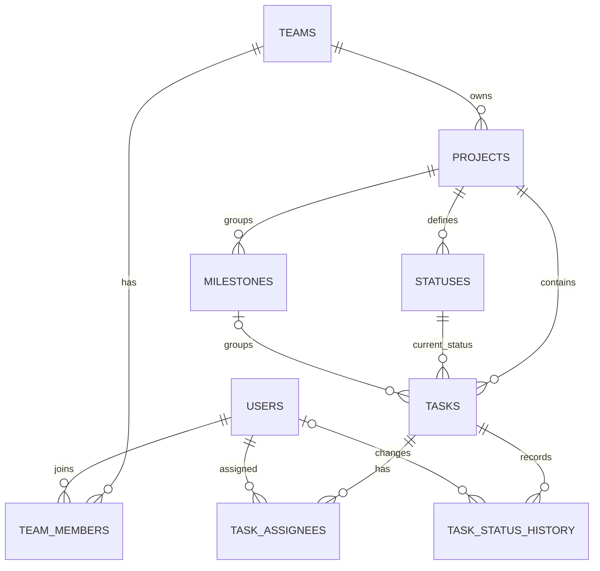

# ASPS-3: GitHub 칸반 데이터 기반 DB 역설계

> 이 문서는 ASPS-1에서 실제로 사용한 GitHub Issues/Projects 데이터를 바탕으로 ASPS-3의 Supabase 관계형 데이터베이스를 설계하기 위한 초안이다. GitHub의 내부 데이터베이스를 복제하는 것이 아니라, API 또는 CSV로 확인할 수 있는 데이터를 추출한 뒤 우리 프로젝트에 맞는 구조로 정규화한다.

## 1. 프로젝트 목표

- ASPS-1에서 실제 사용한 Issue, 담당자, Milestone, Project Status를 원본 데이터로 사용한다.
- 원본의 반복 데이터와 다대다 관계를 분석하여 관계형 DB로 역설계한다.
- PK, FK, 복합 PK, UNIQUE, CHECK, 삭제 정책, 인덱스, RLS를 목적에 맞게 적용한다.
- GitHub 원본 데이터를 Supabase에 다시 적재하고 JOIN 결과가 원본 보드와 일치하는지 검증한다.
- 단순 CRUD용 테이블이 아니라 데이터 무결성과 향후 분석까지 고려한 설계를 만든다.

## 2. 설계 방향: 실제 데이터에서 시작하고 필요한 만큼 보완

| 구분 | 처음 고려한 방식 | 최종 채택 방식 |
|---|---|---|
| 출발점 | 좋은 칸반 서비스에 필요한 기능을 먼저 정의 | ASPS-1에서 실제로 사용한 데이터를 먼저 추출 |
| 접근 | Top-down | Bottom-up 역설계 후 선택적 보완 |
| 테이블 결정 | 일반적인 기능을 기준으로 추가 | 실제 데이터와 업무 규칙으로 필요성을 설명 |
| 장점 | 확장성이 좋고 완성형 서비스에 가까움 | 과제 근거가 명확하고 과설계를 피할 수 있음 |
| 주의점 | 사용하지 않은 기능까지 포함할 수 있음 | 현재 데이터만 보면 미래에 필요한 규칙을 놓칠 수 있음 |

최종 방향은 두 방법을 결합한다.

1. 실제 GitHub 데이터에서 기본 Entity와 관계를 도출한다.
2. 정규화와 무결성 검토를 통해 구조를 개선한다.
3. 상태 변경 이력, 인덱스, RLS처럼 근거가 있는 고급 요소만 추가한다.

## 3. 실제 GitHub 데이터 확인 결과

2026-09-22에 [JooJeongwon/asps-1](https://github.com/JooJeongwon/asps-1)의 GitHub Issues API를 확인한 결과다.

- Pull Request를 제외한 Issue: **27개**
- Issue 상태: **open 1개, closed 26개**
- 확인된 담당 계정: **4개**
  - `JooJeongwon`
  - `cosuss`
  - `jeongchihoon`
  - `seongsunam`
- 확인된 Milestone: **랜딩페이지 배포 완료하기**
- 실제 Issue에 사용된 Label: **없음**

대표 샘플은 다음과 같다.

| Issue | 제목 | 담당자 | Issue state | Milestone |
|---:|---|---|---|---|
| [#2](https://github.com/JooJeongwon/asps-1/issues/2) | 데이터베이스 연결하기 | `cosuss` | closed | 랜딩페이지 배포 완료하기 |
| [#3](https://github.com/JooJeongwon/asps-1/issues/3) | 랜딩페이지 UI 구현 | `JooJeongwon` | closed | 랜딩페이지 배포 완료하기 |
| [#10](https://github.com/JooJeongwon/asps-1/issues/10) | GCS 9기 26명 데이터 정리 | `seongsunam` | closed | 랜딩페이지 배포 완료하기 |
| [#27](https://github.com/JooJeongwon/asps-1/issues/27) | 사주 데이터 정제 및 Supabase 백엔드 구축 | `cosuss` | closed | 랜딩페이지 배포 완료하기 |
| [#34](https://github.com/JooJeongwon/asps-1/issues/34) | 최종 배포 | `JooJeongwon` | closed | 랜딩페이지 배포 완료하기 |

### 아직 추가 추출이 필요한 데이터

GitHub Issues API에서 확인되는 `open/closed`와 GitHub Projects V2 보드의 `Todo/In Progress/Done`은 서로 다른 값이다.

| 값 | 의미 | 저장 위치 |
|---|---|---|
| Issue state | Issue 자체의 열림/닫힘 상태 | `tasks.issue_state` |
| Project Status | 칸반 보드에서 현재 놓인 업무 단계 | `tasks.status_id` → `statuses` |

따라서 둘을 하나의 `status` 문자열로 합치지 않는다. 현재 대화에서 사용한 보드 상태는 `Todo / In Progress / Done`이지만, 최종 DB에 넣기 전 Project URL, CSV 내보내기 또는 Projects V2 API 결과로 실제 옵션과 각 Issue의 상태를 다시 확인한다.

## 4. 원본 데이터를 한 표로 볼 때 생기는 문제

처음 추출한 데이터를 다음과 같은 평면 구조로 볼 수 있다.

| repository | issue_number | title | issue_state | project_status | assignee | milestone | created_at | closed_at |
|---|---:|---|---|---|---|---|---|---|
| asps-1 | 3 | 랜딩페이지 UI 구현 | closed | Done | JooJeongwon | 랜딩페이지 배포 완료하기 | ... | ... |

이 구조를 그대로 최종 테이블로 사용하면 다음 문제가 생긴다.

- 같은 사용자, 상태, 마일스톤 문자열이 여러 행에 반복된다.
- 담당자 이름이 바뀌면 여러 행을 동시에 수정해야 한다.
- 한 Task에 담당자가 여러 명이면 한 칸에 배열을 넣거나 Task 행을 중복해야 한다.
- 상태 이름의 오타와 표기 차이를 막기 어렵다.
- 현재 상태만 남아 이전 상태와 변경 시점을 분석할 수 없다.

따라서 다음과 같이 분리한다.

| GitHub에서 관찰한 대상 | 관계형 DB Entity | 도출 이유 |
|---|---|---|
| Repository/Project | `projects` | 업무의 소속 단위 |
| GitHub User | `users` | 반복되는 담당자 정보 분리 |
| Issue | `tasks` | 관리할 업무 단위 |
| Project Status | `statuses` | 프로젝트별 워크플로우와 표기 통제 |
| Milestone | `milestones` | 여러 Task가 공유하는 목표 분리 |
| Issue Assignee | `task_assignees` | Task와 User의 N:M 관계 표현 |
| 팀 소속 | `teams`, `team_members` | 프로젝트 소유와 접근 권한 표현 |
| 상태 변경 | `task_status_history` | 변경 시점·변경자·체류 시간 분석 |

## 5. 제안 ERD



직접 추출한 데이터에서 도출되는 핵심은 `projects`, `users`, `tasks`, `statuses`, `milestones`, `task_assignees`다. `teams`, `team_members`는 소유권과 RLS를 위해 추가하고, `task_status_history`는 현재 상태만 저장할 때 생기는 분석 한계를 보완하기 위해 추가한다.

## 6. 테이블 초안

| 테이블 | 주요 컬럼 | 핵심 설계 |
|---|---|---|
| `teams` | `id`, `name`, `created_at` | 프로젝트의 최상위 소유 단위 |
| `users` | `id`, `github_user_id`, `github_username`, `auth_user_id` | GitHub 계정과 Supabase Auth 사용자를 분리해 연결 |
| `team_members` | `team_id`, `user_id`, `role`, `joined_at` | `(team_id, user_id)` 복합 PK로 중복 가입 방지 |
| `projects` | `id`, `team_id`, `name`, `github_repo_id`, `github_repo_full_name`, `created_at` | Team 1:N Project, GitHub 저장소 식별자 보존 |
| `statuses` | `id`, `project_id`, `name`, `position`, `is_done` | 프로젝트별 상태 이름과 순서 관리 |
| `milestones` | `id`, `project_id`, `github_milestone_number`, `title`, `state` | 프로젝트 안에서 GitHub milestone 번호를 UNIQUE 처리 |
| `tasks` | `id`, `project_id`, `status_id`, `milestone_id`, `github_issue_number`, `title`, `description`, `issue_state`, `state_reason`, `created_at`, `updated_at`, `closed_at`, `synced_at` | Issue state와 Project Status를 별도 저장 |
| `task_assignees` | `task_id`, `user_id`, `assigned_at` | `(task_id, user_id)` 복합 PK로 같은 사람의 중복 배정 방지 |
| `task_status_history` | `id`, `task_id`, `from_status_id`, `to_status_id`, `changed_by_user_id`, `changed_at` | Todo → In Progress → Done과 같은 이동 기록 |

### 컬럼별 설명

#### `teams`

| 컬럼 | 설명 |
|---|---|
| `id` | Team의 내부 기본키다. 다른 테이블에서 Team을 참조할 때 사용한다. |
| `name` | Team 이름이다. 공백만 있는 이름은 허용하지 않는다. |
| `created_at` | Team이 ASPS-3 DB에 생성된 시각이다. |

#### `users`

| 컬럼 | 설명 |
|---|---|
| `id` | ASPS-3 내부 사용자 기본키다. 담당자, 팀 멤버, 상태 변경자 관계에서 사용한다. |
| `github_user_id` | GitHub 사용자의 변경되지 않는 숫자 식별자다. GitHub 사용자 동기화와 중복 방지에 사용한다. |
| `github_username` | GitHub 로그인 이름이다. 화면에 담당자 이름을 표시할 때 사용한다. |
| `auth_user_id` | Supabase Auth의 `auth.users.id`와 연결되는 UUID다. 로그인 사용자와 GitHub 사용자를 연결하고 RLS 권한을 판단한다. 아직 연결되지 않은 GitHub 사용자는 NULL일 수 있다. |
| `created_at` | 사용자가 ASPS-3 DB에 등록된 시각이다. |

#### `team_members`

| 컬럼 | 설명 |
|---|---|
| `team_id` | 소속 Team의 ID다. `teams.id`를 참조한다. |
| `user_id` | Team에 속한 사용자의 ID다. `users.id`를 참조한다. |
| `role` | Team 내 권한이다. 현재 `owner`, `admin`, `member`를 사용한다. |
| `joined_at` | 사용자가 Team에 가입된 시각이다. |

#### `projects`

| 컬럼 | 설명 |
|---|---|
| `id` | ASPS-3 프로젝트의 내부 기본키다. |
| `team_id` | 프로젝트를 소유한 Team의 ID다. `teams.id`를 참조하며 RLS의 최상위 접근 경계로 사용한다. |
| `name` | ASPS-3에서 표시하는 프로젝트 이름이다. |
| `github_repo_id` | 연결된 GitHub 저장소의 숫자 식별자다. 저장소 동기화와 중복 방지에 사용한다. |
| `github_repo_full_name` | `소유자/저장소명` 형식의 GitHub 저장소 이름이다. 예: `JooJeongwon/asps-1` |
| `created_at` | 프로젝트가 ASPS-3 DB에 생성된 시각이다. |
| `github_project_id` | GitHub Projects V2의 Node ID다. 외부 프로젝트를 안정적으로 식별한다. |
| `github_project_number` | GitHub Projects V2 화면에서 사용하는 프로젝트 번호다. |
| `github_project_url` | GitHub Projects V2 프로젝트 화면 링크다. |
| `github_project_owner_username` | GitHub Project 소유자의 사용자명이다. |
| `github_project_owner_type` | GitHub Project 소유자 유형이다. 예: `User`, `Organization` |
| `github_project_is_public` | GitHub Project가 공개 프로젝트인지 나타낸다. |
| `github_project_is_closed` | GitHub Project가 닫혔는지 나타낸다. |

#### `statuses`

| 컬럼 | 설명 |
|---|---|
| `id` | 상태의 내부 기본키다. Task와 상태 이력에서 참조한다. |
| `project_id` | 상태가 속한 프로젝트의 ID다. `projects.id`를 참조한다. |
| `name` | 칸반 보드에 표시할 상태 이름이다. 예: `Backlog`, `In progress`, `Done` |
| `position` | 보드에서 상태 컬럼을 표시할 순서다. 0부터 시작한다. |
| `is_done` | 해당 상태를 칸반상 완료 상태로 취급할지 나타낸다. GitHub Issue의 `closed`와는 별도 개념이다. |

#### `milestones`

| 컬럼 | 설명 |
|---|---|
| `id` | ASPS-3 내부 마일스톤 기본키다. |
| `project_id` | 마일스톤이 속한 프로젝트의 ID다. `projects.id`를 참조한다. |
| `github_milestone_number` | GitHub 저장소 안에서 마일스톤을 식별하는 번호다. |
| `title` | 마일스톤 이름이다. |
| `state` | GitHub 마일스톤 상태다. 현재 `open` 또는 `closed`를 사용한다. |

#### `tasks`

| 컬럼 | 설명 |
|---|---|
| `id` | ASPS-3 Task의 내부 기본키다. |
| `project_id` | Task가 속한 프로젝트의 ID다. `projects.id`를 참조한다. |
| `status_id` | 칸반 보드에서 Task가 현재 위치한 상태의 ID다. `statuses.id`를 참조한다. |
| `milestone_id` | Task에 연결된 마일스톤의 ID다. 없으면 NULL이다. |
| `github_issue_number` | GitHub 저장소 안에서 Issue를 표시하는 번호다. 예: `#27` |
| `title` | Issue 또는 Task 제목이다. |
| `description` | Issue 본문 또는 Task 상세 설명이다. |
| `issue_state` | GitHub Issue 자체의 상태다. 현재 `open` 또는 `closed`를 사용한다. 칸반 상태인 `status_id`와 구분한다. |
| `state_reason` | GitHub Issue가 닫힌 이유다. 예: `completed`, `not_planned`, `reopened`, `duplicate` |
| `created_at` | 원본 GitHub Issue가 생성된 시각이다. |
| `updated_at` | 원본 GitHub Issue가 마지막으로 수정된 시각이다. |
| `closed_at` | 원본 GitHub Issue가 닫힌 시각이다. 열려 있으면 NULL이다. |
| `synced_at` | 해당 Task의 GitHub 원본을 ASPS-3에 마지막으로 동기화한 시각이다. |
| `github_issue_id` | GitHub Issue의 안정적인 숫자 식별자다. Issue 번호가 바뀌거나 저장소가 여러 개일 때도 원본을 식별한다. |
| `github_project_item_id` | GitHub Projects V2에서 해당 Issue를 가리키는 Project Item 식별자다. |
| `github_author_id` | Issue 작성자의 GitHub 사용자 숫자 ID다. |
| `github_author_username` | Issue 작성자의 GitHub 사용자명이다. |
| `github_author_association` | 작성자와 저장소의 관계다. 예: `OWNER`, `MEMBER`, `CONTRIBUTOR` |
| `github_closed_by_id` | Issue를 닫은 GitHub 사용자의 숫자 ID다. 알 수 없으면 NULL이다. |
| `github_closed_by_username` | Issue를 닫은 GitHub 사용자명이다. 알 수 없으면 NULL이다. |
| `github_comments_count` | GitHub 원본 Issue의 댓글 수 스냅샷이다. 상세 댓글은 `task_comments`에서 관리한다. |
| `github_reactions` | Issue에 달린 GitHub Reaction 집계 원본이다. JSONB로 저장한다. |

#### `task_assignees`

| 컬럼 | 설명 |
|---|---|
| `task_id` | 담당자가 배정된 Task의 ID다. `tasks.id`를 참조한다. |
| `user_id` | Task에 배정된 사용자의 ID다. `users.id`를 참조한다. |
| `assigned_at` | 사용자가 Task에 배정된 시각이다. |

#### `task_status_history`

| 컬럼 | 설명 |
|---|---|
| `id` | 상태 변경 기록의 기본키다. |
| `task_id` | 상태가 변경된 Task의 ID다. `tasks.id`를 참조한다. |
| `from_status_id` | 변경 전 상태의 ID다. 최초 등록처럼 이전 상태가 없으면 NULL이다. |
| `to_status_id` | 변경 후 상태의 ID다. `statuses.id`를 참조한다. |
| `changed_by_user_id` | 변경을 수행한 ASPS-3 사용자의 ID다. 외부 동기화 등 변경자를 알 수 없으면 NULL이다. |
| `changed_at` | 상태가 변경된 시각이다. |

#### `task_comments`

| 컬럼 | 설명 |
|---|---|
| `id` | 댓글의 ASPS-3 내부 기본키다. |
| `task_id` | 댓글이 달린 Task의 ID다. `tasks.id`를 참조한다. |
| `github_comment_id` | GitHub 댓글의 숫자 식별자다. |
| `github_comment_node_id` | GitHub 댓글의 Node ID다. |
| `github_comment_url` | GitHub 댓글 화면 또는 API 링크다. |
| `github_author_id` | 댓글 작성자의 GitHub 사용자 숫자 ID다. |
| `github_author_username` | 댓글 작성자의 GitHub 사용자명이다. |
| `body` | 댓글 본문이다. |
| `comment_created_at` | GitHub에서 댓글이 작성된 시각이다. |
| `comment_updated_at` | GitHub에서 댓글이 마지막 수정된 시각이다. |
| `github_reactions` | 댓글에 달린 GitHub Reaction 집계 원본이다. |
| `github_payload` | 동기화 당시 GitHub 댓글 원본 JSON이다. |
| `created_at` | 댓글이 ASPS-3 DB에 저장된 시각이다. |

#### `task_timeline_events`

| 컬럼 | 설명 |
|---|---|
| `id` | 타임라인 이벤트의 ASPS-3 내부 기본키다. |
| `task_id` | 이벤트가 발생한 Task의 ID다. `tasks.id`를 참조한다. |
| `github_event_key` | Task 안에서 이벤트를 중복 적재하지 않기 위한 식별 키다. |
| `github_event_id` | GitHub 이벤트의 숫자 식별자다. |
| `github_event_node_id` | GitHub 이벤트의 Node ID다. |
| `github_event_url` | GitHub 이벤트의 원본 링크다. |
| `event_type` | 이벤트 종류다. 예: `project_v2_item_status_changed`, `assigned`, `closed` |
| `github_actor_id` | 이벤트를 발생시킨 GitHub 사용자의 숫자 ID다. |
| `github_actor_username` | 이벤트를 발생시킨 GitHub 사용자명이다. |
| `occurred_at` | GitHub에서 실제 이벤트가 발생한 시각이다. |
| `github_payload` | 이벤트의 상세 원본 JSON이다. 상태 변경 전후 값처럼 정규화하지 않은 GitHub 데이터를 보존한다. |
| `created_at` | 이벤트가 ASPS-3 DB에 저장된 시각이다. |

### 주요 관계

- Team 1:N Project
- Team N:M User → `team_members`
- Project 1:N Status
- Project 1:N Milestone
- Project 1:N Task
- Status 1:N Task
- Milestone 1:N Task
- Task N:M User → `task_assignees`
- Task 1:N TaskStatusHistory

## 7. 무결성 설계 포인트

### PK와 UNIQUE

- 모든 독립 Entity는 단일 PK를 가진다.
- 관계 자체가 식별자인 `team_members`, `task_assignees`는 복합 PK를 사용한다.
- `users.github_user_id`와 `users.github_username`은 UNIQUE로 관리한다.
- `projects.github_repo_id`는 UNIQUE로 관리한다.
- `statuses`에는 `UNIQUE(project_id, name)`과 `UNIQUE(project_id, position)`을 둔다.
- `tasks`에는 `UNIQUE(project_id, github_issue_number)`를 둔다.
- `milestones`에는 `UNIQUE(project_id, github_milestone_number)`를 둔다.

### 같은 프로젝트 데이터만 참조하도록 보장

단순히 `tasks.status_id → statuses.id`만 연결하면 다른 프로젝트의 Status를 잘못 참조할 수 있다. 최종 DDL에서는 `(project_id, status_id)`가 같은 프로젝트의 `statuses(project_id, id)`를 참조하도록 복합 FK를 검토한다. `milestone_id`에도 같은 원칙을 적용한다.

### CHECK

- `statuses.position >= 0`
- `tasks.issue_state IN (open, closed)`
- `closed_at IS NULL OR closed_at >= created_at`
- 완료 상태와 완료 시각 사이의 모순을 막는 조건

### 삭제 정책

- Team 또는 Project와 생명주기를 완전히 공유하는 하위 데이터는 `ON DELETE CASCADE`를 사용한다.
- Task 삭제 시 담당 관계와 상태 이력은 함께 삭제한다.
- 과거 변경자 정보는 보존 가치가 있으므로 `changed_by_user_id`는 사용자 삭제 시 `SET NULL`을 고려한다.

## 8. 상태 이력 사용 원칙

현재 GitHub 스냅샷만으로 과거의 모든 칸반 이동을 임의로 복원하지 않는다.

- 최초 가져오기 시 현재 Status를 “최초 관찰 상태”로 기록할 수 있다.
- 구현 이후 발생하는 Status 변경부터 `task_status_history`에 정확히 적재한다.
- GitHub 이벤트나 Project item 이력을 추가로 추출할 수 있을 때만 과거 이력을 보완한다.

이를 통해 다음 질문에 답할 수 있다.

- 누가 언제 상태를 변경했는가?
- Task가 In Progress에 얼마나 오래 있었는가?
- 완료까지 걸린 시간은 얼마인가?
- 특정 기간에 완료된 업무는 몇 개인가?

## 9. 인덱스 초안

실제 칸반 화면과 조회 패턴을 기준으로 다음 인덱스를 우선 고려한다.

```sql
create index idx_tasks_project_status
    on tasks (project_id, status_id);

create index idx_tasks_project_milestone
    on tasks (project_id, milestone_id);

create index idx_task_assignees_user
    on task_assignees (user_id);

create index idx_task_status_history_task_changed_at
    on task_status_history (task_id, changed_at);
```

인덱스는 많을수록 좋은 것이 아니므로 실제 SELECT와 실행 계획을 확인한 뒤 확정한다.

## 10. Supabase RLS 구상

`users.auth_user_id`를 `auth.users.id`와 연결하고 `team_members`를 통해 접근 권한을 판단한다.

```text
auth.uid()
  → users.auth_user_id
  → team_members.user_id
  → projects.team_id
  → tasks.project_id
```

기본 정책은 다음과 같다.

- 사용자는 자신이 속한 Team의 Project, Status, Milestone, Task를 조회할 수 있다.
- Team 역할에 따라 생성·수정·삭제 권한을 구분한다.
- GitHub에서 가져왔지만 아직 로그인 계정이 없는 사용자는 `auth_user_id`를 NULL로 둘 수 있다.
- Service Role을 사용하는 동기화 작업과 일반 사용자의 권한을 분리한다.

## 11. 이번 범위에서 제외하는 것

현재 실제 Issue에서 Label을 사용하지 않았으므로 `labels`, `task_labels`는 1차 설계에서 제외한다. 댓글, 첨부파일, 알림, Pull Request 전용 구조도 실제 요구가 확인될 때 추가한다.

이 원칙은 “GitHub가 제공하는 모든 기능을 복제”하는 것이 아니라 “우리 팀이 실제로 사용한 기능을 근거로 설계”하기 위한 것이다.

## 12. 구현 순서

1. GitHub Issues 원본 JSON을 저장한다.
2. GitHub Projects V2의 Project URL 또는 CSV를 확보한다.
3. 실제 Status 옵션과 각 Issue의 현재 Project Status를 확인한다.
4. 원본을 평면 테이블 또는 staging 테이블에 먼저 적재한다.
5. 반복 값과 N:M 관계를 확인하며 정규화한다.
6. Supabase용 최종 `CREATE TABLE` SQL을 작성한다.
7. ASPS-1 실제 데이터를 넣는 seed/INSERT SQL을 작성한다.
8. JOIN View 또는 검증 SELECT로 원본 보드와 결과를 대조한다.
9. 인덱스와 RLS를 적용하고 권한별 테스트를 수행한다.

## 13. 완료 기준

- 모든 Task가 원본 Issue 번호와 제목을 유지한다.
- 한 Task에 여러 담당자를 배정할 수 있다.
- 담당자, Status, Milestone의 중복 문자열이 정규화되어 있다.
- 잘못된 FK, 중복 담당자, 중복 Issue 번호가 DB 수준에서 차단된다.
- Issue state와 Project Status가 구분된다.
- 프로젝트별·상태별 Task 목록을 JOIN으로 재현할 수 있다.
- 다른 Team 사용자가 접근할 수 없도록 RLS 테스트가 통과한다.

## 발표용 핵심 설명

> 지난 프로젝트에서 실제 사용한 GitHub Projects 칸반 보드와 Issue 데이터를 추출한 뒤, 반복되는 사용자·상태·마일스톤과 다대다 담당 관계를 발견해 관계형 DB로 정규화했습니다. 이후 복합 키와 제약조건으로 데이터 무결성을 보장하고, 상태 변경 이력·인덱스·RLS를 실제 사용 목적에 맞게 보완했습니다.
