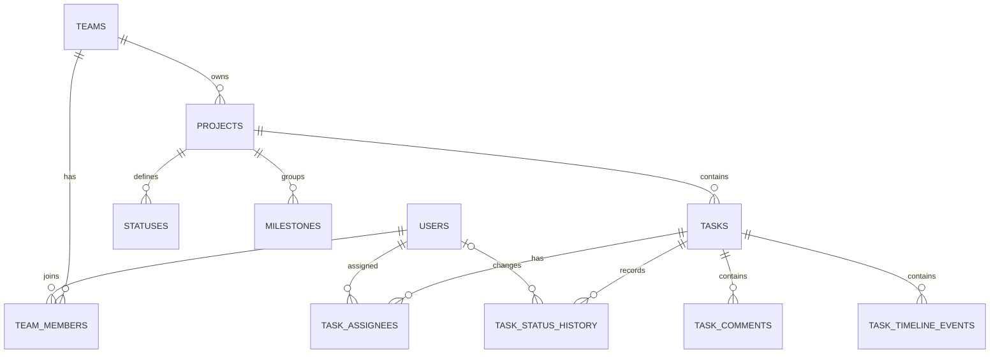

# ASPS-3 Database Architecture

## Scope

ASPS-3 stores the ASPS-1 GitHub Projects Kanban snapshot in Supabase PostgreSQL.
The database separates GitHub Issue state from GitHub Project status and preserves
the original GitHub payloads for synchronization and audit.

## Entity relationship

## Tables

| Table | Responsibility |
|---|---|
| `teams` | Top-level ownership boundary |
| `users` | GitHub users and optional Supabase Auth linkage |
| `team_members` | Team membership and role |
| `projects` | Repository and GitHub Project identity, metadata, and field definitions |
| `statuses` | Project-specific Kanban status and ordering |
| `milestones` | GitHub milestone metadata |
| `tasks` | GitHub Issues placed on the Kanban board |
| `task_assignees` | Task–user many-to-many assignments |
| `task_status_history` | Current and historical Kanban status transitions |
| `task_comments` | GitHub Issue comments |
| `task_timeline_events` | GitHub Issue and Project timeline events |

### `projects`

Stores the repository and Project V2 identifiers:

- `github_repo_id`, `github_repo_full_name`
- `github_project_id`, `github_project_number`
- Project URL, owner, visibility, closed state, description, and README
- `github_project_payload` and `github_project_fields_payload` retain the source JSON

### `tasks`

Stores both Issue-level and Kanban-level state:

- Issue number, numeric ID, Project Item ID, item type, title, description
- Issue state and Project status are intentionally separate
- Issue URL/API URL/node ID, repository and API links
- Author, lock state, closed-by user, comment count, reactions, sub-issue/dependency summaries
- Project custom fields: priority, size, estimate, start date, target date
- `github_issue_payload` and `github_project_item_payload` retain the complete source snapshots

### Child tables

- `task_comments`: comment body, author, timestamps, reactions, and original JSON
- `task_timeline_events`: event type, actor, timestamp, source identifiers, and original JSON

## Access control

- RLS is enabled on every `public` table.
- Authenticated users read only rows reachable through their team/project membership.
- Comments and timeline events use `private.can_access_task(task_id)`.
- GitHub synchronization/import is intended for the `service_role`.
- Auth schema data and secrets are not included in the repository export.

## Current snapshot

| Table | Rows |
|---|---:|
| teams | 1 |
| users | 4 |
| team_members | 4 |
| projects | 1 |
| statuses | 5 |
| milestones | 1 |
| tasks | 17 |
| task_assignees | 16 |
| task_status_history | 17 |
| task_comments | 2 |
| task_timeline_events | 209 |

Source project: [JooJeongwon/asps-1 Project 1](https://github.com/users/JooJeongwon/projects/1)

The accompanying [database-data.json](./database-data.json) is a point-in-time
snapshot of the public schema data used by this architecture document.

